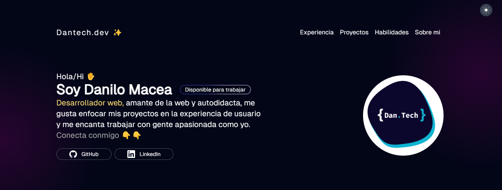

<!-- Improved compatibility of back to top link: See: https://github.com/othneildrew/Best-README-Template/pull/73 -->
<a name="readme-top"></a>
<!--
*** Thanks for checking out the Best-README-Template. If you have a suggestion
*** that would make this better, please fork the repo and create a pull request
*** or simply open an issue with the tag "enhancement".
*** Don't forget to give the project a star!
*** Thanks again! Now go create something AMAZING! :D
-->


<!-- PROJECT SHIELDS -->
<!--
*** I'm using markdown "reference style" links for readability.
*** Reference links are enclosed in brackets [ ] instead of parentheses ( ).
*** See the bottom of this document for the declaration of the reference variables
*** for contributors-url, forks-url, etc. This is an optional, concise syntax you may use.
*** https://www.markdownguide.org/basic-syntax/#reference-style-links
-->

[![Stargazers][stars-shield]][stars-url]
[![LinkedIn][linkedin-shield]][linkedin-url]


<!-- PROJECT LOGO -->
<br />
<div align="center">
  <a href="https://github.com/github_username/repo_name">
    
  </a>

<h3 align="center">Dantech.dev Portafolio Web</h3>

  <p align="center">
    Hace mucho tiempo que venia con esta idea en la cabeza, tener mi propio espacio en la web en donde mostrarme y dar a conocer mi perfil tanto personal como profesional, construir un portafolio requiere de compromiso, dedicación y esfuerzo, es una tarea casi que necesaria para todo aquel que este empezando en el mundo TI y también para los que ya llevan mucho tiempo en el, un portafolio es una forma de mostrar el conocimiento, los logros y la trayectoria profesional que una persona puede tener a lo largo de su vida laboral, y sobre todo también es una herramienta para acaparar y darse a conocer ante futuras empresas.
    <br />
  </p>
</div>


<!-- TABLE OF CONTENTS -->
<details>
  <summary>Table of Contents</summary>
  <ol>
    <li>
      <a href="#about-the-project">About The Project</a>
      <ul>
        <li><a href="#built-with">Built With</a></li>
      </ul>
    </li>
    <li>
      <a href="#getting-started">Getting Started</a>
      <ul>
        <li><a href="#installation">Installation</a></li>
      </ul>
    </li>
    <li><a href="#license">License</a></li>
    <li><a href="#contact">Contact</a></li>
  </ol>
</details>


<!-- ABOUT THE PROJECT -->
## About The Project




<p align="right">(<a href="#readme-top">back to top</a>)</p>


### Built With

[](https://astro.build)

<p align="right">(<a href="#readme-top">back to top</a>)</p>


<!-- GETTING STARTED -->
## Getting Started


### Installation


1. Clone the repo
   ```sh
   git clone https://github.com/dantech99/dantech.dev
   ```
2. Install NPM packages
   ```sh
   npm install

   pnpm install
   ```

3. Running project
    ```
    pnpm run dev
    pnpm astro dev
    ```

<p align="right">(<a href="#readme-top">back to top</a>)</p>


<!-- USAGE EXAMPLES -->
##  project estructure

```
.
├── node_modules
├── public
└── src
    ├── assets
    ├── components
    ├── data
    ├── icons
    ├── layouts
    ├── pages
    ├── sections
    └── styles
```


<p align="right">(<a href="#readme-top">back to top</a>)</p>


<!-- LICENSE -->
## License

Distributed under the MIT License. See `LICENSE.txt` for more information.

<p align="right">(<a href="#readme-top">back to top</a>)</p>


<!-- CONTACT -->
## Contact

[antoniomcs21@hotmail.com](antoniomcs21@hotmail.com) - 

Preview: [https://dantech.dev/](https://dantech.dev)

<p align="right">(<a href="#readme-top">back to top</a>)</p>


<!-- MARKDOWN LINKS & IMAGES -->
<!-- https://www.markdownguide.org/basic-syntax/#reference-style-links -->

[stars-shield]: https://img.shields.io/github/stars/github_username/repo_name.svg?style=for-the-badge
[stars-url]: https://github.com/dantech99/dantech.dev
[linkedin-shield]: https://img.shields.io/badge/-LinkedIn-black.svg?style=for-the-badge&logo=linkedin&colorB=555
[linkedin-url]: https://www.linkedin.com/in/dantechdev
[product-screenshot]: images/screenshot.png


