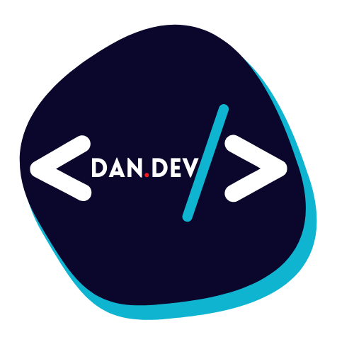

# Mi Portafolio Web

 ## *Hola ✌ Bienvenido a Mi Portafolio Web ✨😎🚀🚀*

Hace mucho tiempo que venia con esta idea en la cabeza, tener mi propio espacio en la web en donde mostrarme y dar a conocer mi perfil tanto personal como profesional, construir un portafolio requiere de compromiso, dedicación y esfuerzo, es una tarea casi que necesaria para todo aquel que este empezando en el mundo TI y también para los que ya llevan mucho tiempo en el, un portafolio es una forma de mostrar el conocimiento, los logros y la trayectoria profesional que una persona puede tener a lo largo de su vida laboral, y sobre todo también es una herramienta para acaparar y darse a conocer ante futuras empresas.

**Por supuesto no quería quedarme atrás y empecé este proyecto personal para desarrollar mi portafolio web.**

